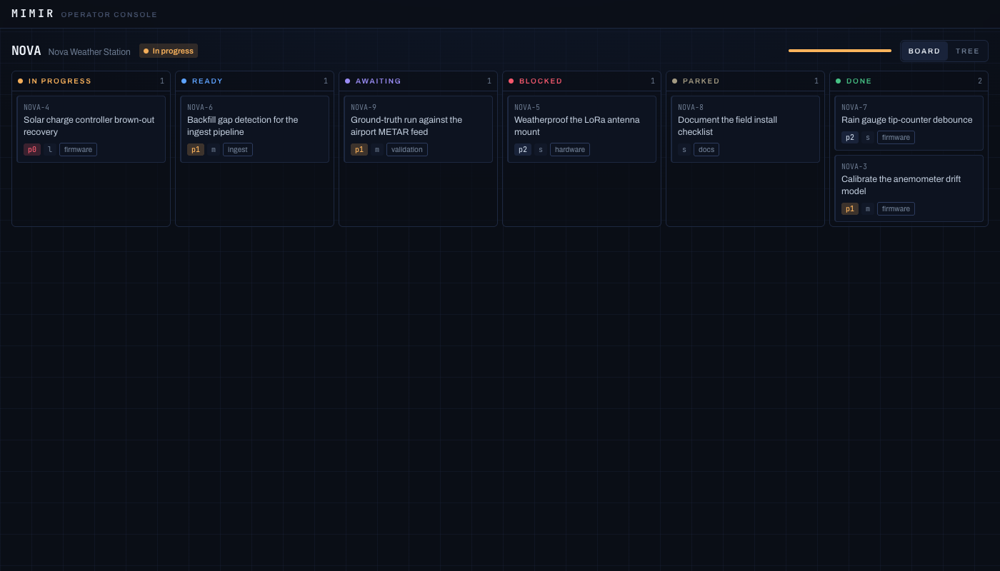

# mimir

Mimir is the source of truth for **work state** — tasks, the work hierarchy, and
the frozen artifacts attached to them. It is the _work_ tool in a three-part
split along the founding distinction of knowledge vs. work: **Norn** keeps
knowledge, **Mimir** holds work state, **Saga** weaves them into a session.

Work state lives in a **Norn-managed markdown vault** — git-backed, inspectable
markdown files are the source of truth; Norn owns all reads, writes, and
integrity, and Mimir is the business-logic and derivation layer over it (ADR
0016). Status rollups and dependency predicates are **derived live, never
stored** (caching them is the sync problem Mimir exists to remove). One core
query layer, four surfaces: a **CLI** for humans and scripts, **MCP** for
agents (plus an embedded agent skill the binary installs itself), an **HTTP
API**, and a web **operator console** served by the same binary.



> **Status:** **pre-release** (`0.x`), feature-complete for single-operator
> use: the full read + write verb surface over CLI and MCP, the agent skill
> (`mimir skill install`) with repo binding (`.mimir.toml`), the HTTP API
> (`mimir serve`), and the read-only operator console — a kanban/tree PWA
> embedded in the binary (columns are the status vocabulary; the Ready column
> in rank order _is_ the queue). Write affordances in the console, and the
> auth story that must precede them, are the next slices.

## Install

**Standalone binary** (no Bun needed on the target):

```sh
curl -fsSL https://raw.githubusercontent.com/dbtlr/mimir/main/install.sh | sh
```

Installs the binary for your platform from the latest [release](https://github.com/dbtlr/mimir/releases)
to `~/.local/bin` (override with `MIMIR_INSTALL_DIR`, pin with `MIMIR_VERSION`).

**From source** (requires [Bun](https://bun.sh) `1.3.14`):

```sh
git clone https://github.com/dbtlr/mimir && cd mimir && bun install
bun run build    # compiles dist/mimir; or `bun run mimir <verb>` straight from source
```

## Quickstart

```sh
mimir --version
mimir --help
mimir setup          # first-run: create the vault + optionally install the service
```

The vault lives at `$XDG_DATA_HOME/mimir/vault` (default
`~/.local/share/mimir/vault`) and is created on first use, so `mimir` works from
any directory; set `MIMIR_VAULT` (or `[vault] path` in the config) to point at a
vault elsewhere. Mimir shells out to the `norn` binary for all vault access
(ADR 0018), so `norn` must be on `PATH`.

Every entity has one rendered id, spoken by every surface: a project is the
bare `KEY`, a tree node is `KEY-seq` (`MMR-16`), an artifact is `KEY-aN`
(`MMR-a1`). Any id position takes the full grammar — the verb rejects what it
can't act on.

The read commands (one intent layer, rendered as CLI or MCP):

```sh
mimir next                        # ready tasks in rank order — "what's next"
mimir next --scope MMR -p p0      # filter by project / priority (signals, not sort)
mimir list --status done          # universe: status words, or live|terminal|all
mimir list --is stale             # verdicts: stale|blocking|orphaned (--not-is negates)
mimir list --eq priority:p1 --missing size --after created_at:2026-06-01
mimir get MMR                     # the whole-project view (rollup + roots)
mimir get MMR-16                  # full record for one node (KEY-seq id)
mimir get MMR-16 --col history    # add the transition log
mimir get MMR-a1 --col content    # an artifact, with its frozen body
mimir status MMR-3                # an initiative/phase rollup (distribution + status)
mimir next --format json | jq .   # structured, pipe-safe output
```

Selection is AND-composed: `--status` picks the universe, `--is`/`--not-is`
verdicts and the field operators (`--eq` `--not-eq` `--in` `--not-in` `--has`
`--missing` + date ops) filter within it. A value miss (`--eq priority:p9`)
warns and returns an empty set (exit 0); an unknown field is a usage error
(exit 2).

The write verbs:

```sh
mimir create task "wire the API" --parent MMR-2 --priority p1 --tag api
mimir start MMR-3 && mimir done MMR-3
mimir depend MMR-4 --on MMR-3     # MMR-4 waits on MMR-3
mimir tag MMR-3,MMR-a1 spec v2    # tag tasks, projects, artifacts (free-text)
mimir attach MMR-3 --file plan.md # freeze an artifact (title from basename)
```

Formats: `table` / `records` (styled TTY) and `ids` / `json` / `jsonl`
(structural, never styled). The default follows the destination — a table for a
TTY set, `ids` when piped — and `--format` overrides. Identity selection
(`get`/`status`) exits non-zero on a missing id; set selection (`next`/`list`)
exits 0 on an empty result.

Run as an MCP server for an agent:

```sh
mimir mcp     # JSON-RPC over stdio; the same read + write surface as tools
```

Serve the HTTP API and the operator console:

```sh
mimir serve   # loopback-only, default port 64647
```

`http://127.0.0.1:64647/` is the console (the screenshot above): an Overview
of every project with an attention strip of in-flight and stuck work, and a
per-project kanban board / tree with a detail drawer on every node. It is an
installable PWA — usable from a phone behind your own reverse proxy — that
polls while visible and, when the server is unreachable, shows the last-synced
board behind an explicit offline banner. This first cut is **read-only**; the
API under `/api/*` carries the same verb surface as the CLI/MCP for writes
(TLS, hostnames, and exposure belong to the proxy in front — the binary stays
loopback-only).

## The model

```
project → initiative → phase → task        (the work tree, via parent_id)
```

- **Two status axes** on tasks: `lifecycle` (todo → in_progress → done /
  abandoned) and a `hold` overlay (none / blocked / parked). Non-leaf nodes
  store **no** status — their truth is the live **distribution** over children,
  reduced to one **status word** by a canonical `interpret` cascade.
- **Rank** is a single relative order that wins over priority; priority/size are
  orthogonal _signals_ that filter and advise, never the sort.
- **Derived, never stored:** `ready`, `awaiting`, `blocked`, `blocking`,
  `stale`, `orphaned`, and every rollup.

The reasoning behind the model lives in
[`docs/decisions/`](docs/decisions/README.md) (the ADRs), with the concrete
schema in [`docs/schema-reference.md`](docs/schema-reference.md) and the
CLI/MCP output contract in
[`docs/output-contract-reference.md`](docs/output-contract-reference.md).

## Development

```sh
bun install
bun run verify    # the full gate: format, lint, typecheck, test
```

`verify` is `bun run check` (oxfmt + oxlint + type-aware typecheck, zero-warning)
plus `bun test` (the store-backed suites run against a temp Norn vault, so they
need `norn` on `PATH`; they skip without it) plus `bun run test:ui` (the
console's vitest suite) — the same gate CI enforces. For UI work, run
`vite dev` in `packages/ui` against a running `mimir serve` (localhost CORS is
pre-wired); `bun run build` builds the console and embeds it in the compiled
binary. `main` is protected; changes land via PR. See
[CONTRIBUTING.md](./CONTRIBUTING.md), [CHANGELOG.md](./CHANGELOG.md), and
[SECURITY.md](./SECURITY.md).

Architecture — one core, thin transports:

```
packages/contract/   @mimir/contract — pure DTO + wire types (the dependency-free leaf; the UI imports it)
packages/bin/        @mimir/bin — the binary
  src/core/          domain logic over the Store seam: derivation, rank, verbs, intent layer
  src/norn/          the Norn client + vault write path (speaks to the `norn` binary)
  src/cli/           the human transport (parseArgs + styled/structured renderers)
  src/mcp/           the agent transport (official MCP SDK over stdio)
  src/http/          the UI transport (resource-shaped REST over Bun.serve)
  src/main.ts        composition root — dispatches subcommands
packages/ui/         @mimir/ui — the operator console SPA (embedded in the binary)
```

The layering `contract ← core ← transports` is enforced by an oxlint
`no-restricted-imports` rule: `core` may not import a transport, and the
transports may not import each other.

## License

[MIT](./LICENSE)
