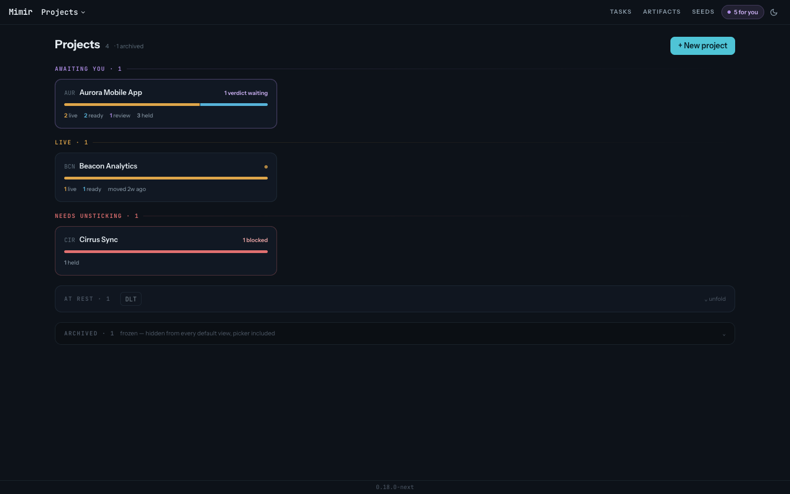

# mimir

Mimir is a local-first source of truth for agent-driven work. It keeps projects,
tasks, dependencies, decisions, and work products in one queryable system so an
agent can act on current state and an operator can see what needs attention.

Work state lives in a Norn-managed Markdown vault by default, or in a shared
PostgreSQL database for agents on several machines.
Mimir derives queues, status rollups, blockers, and stale work when queried;
there is no second cache of project status to keep in sync.



## Why Mimir

- **One work model.** The CLI, MCP server, HTTP API, and operator console use the
  same domain logic.
- **Agent-ready context.** Repository binding and `mimir overview` give an agent
  the current direction, active work, ready queue, dependencies, and recent
  sessions.
- **Operator control.** The console spans projects, tasks, Artifacts, Seeds, and
  record health. It supports daily authoring and lifecycle actions.
- **Store ownership.** Choose a local Markdown vault with Norn-managed access
  and Git snapshots, or a shared PostgreSQL database with transactional writes.
- **Derived state.** Rank, dependencies, lifecycle, and holds determine what is
  ready, awaiting, blocked, stale, or complete.

## What it handles

| Need | Mimir capability |
| --- | --- |
| Plan and run work | Project → initiative → phase → task hierarchy, ranked queues, dependencies, lifecycle, and holds |
| Preserve outcomes | Frozen, tagged Artifacts linked to the work that produced them |
| Keep temporary context | Resumable Scratchpads with a Journal and Agenda that freeze into Artifacts |
| Groom new work | Seeds for ideas, bugs, features, and cross-project requests |
| Resume agent sessions | Direction, execution handles, annotations, and session-summary Artifacts |
| Operate the store | Record diagnostics, conservative repair, snapshots, service management, and self-update |

## Five-minute start

Install the standalone binary:

```sh
curl -fsSL https://raw.githubusercontent.com/dbtlr/mimir/main/install.sh | sh
```

For an existing installation without a receipt, use the
[legacy upgrade procedure](docs/guides/install-location.md#upgrade-an-installation-without-a-receipt).

Choose the store before setup:

- **Norn (default):** Install `norn` on `PATH`, then run `mimir setup` to create
  or adopt a vault and optionally install the local service.
- **PostgreSQL:** Skip `mimir setup`. Follow the
  [Postgres store guide](docs/guides/postgres-store.md) to set `[store] backend`
  to `"postgres"` and `url` in the installation's bound `config.toml`, then run
  `mimir store upgrade`. Run `mimir serve` directly or under your supervisor.
  Optional macOS `mimir service install` still requires `norn` for its launchd
  preflight, including on a PostgreSQL installation.

Then create a project and bind a repository to it:

```sh
mimir create project "Aurora" --key AUR --yes
cd path/to/aurora
mimir bind AUR
mimir skill install --global --agent codex
```

From the bound repository, an agent can orient and begin the highest-ranked
ready task without repeating the project key:

```sh
mimir overview
mimir next
initiative_id=$(mimir create initiative "Release 1.0" --parent AUR -f ids)
task_id=$(mimir create task "Verify sign-in recovery" --parent "$initiative_id" --size s -f ids)
mimir start "$task_id"
```

Run `mimir serve` and open the URL printed at startup to use the operator
console. The production default is `http://127.0.0.1:64647/`; Mimir remains
loopback-only, so remote access belongs behind a trusted reverse proxy.

## Learn Mimir

- [Start with an agent-driven repository](docs/user/getting-started.md)
- [Plan and run work](docs/user/planning-and-running-work.md)
- [Capture temporary work with Scratchpads](docs/user/capturing-temporary-work.md)
- [Preserve work products as Artifacts](docs/user/preserving-work-products.md)
- [Groom new work with Seeds](docs/user/grooming-new-work.md)
- [Use the operator console](docs/user/using-the-console.md)
- [Work with agents](docs/user/working-with-agents.md)

The [user guide](docs/user/README.md) collects these workflows. Installed-service
operations live in [docs/guides](docs/guides/README.md). The maintained
[schema](docs/schema-reference.md), [output contract](docs/output-contract-reference.md),
and [ADRs](docs/decisions/README.md) cover engineering details.

## Status

Mimir is pre-release (`0.x`) and built for a single operator. The CLI, MCP,
HTTP API, and console cover read and write workflows. The console is an
installable PWA with cached offline reads; writes require a live server and are
not queued offline. Authentication and multi-operator collaboration are outside
the current binary.

## Develop

Mimir uses Bun `1.4.0`:

```sh
bun install
bun run verify
```

For Postgres development, run `bun run sandbox create`. Use
`bun run test:postgres` for the disposable server lane and `bun run test:sandbox`
for native snapshot rehearsals. See the [sandbox guide](docs/guides/development-sandboxes.md)
for fixture, restore, upgrade, and cleanup commands.

Generate the deterministic demo workspace used for documentation and visual
testing with `bun run fixtures:vault .dev/docs-fixture`. See
[CONTRIBUTING.md](CONTRIBUTING.md) for the project structure and review process.

## License

[MIT](LICENSE)
