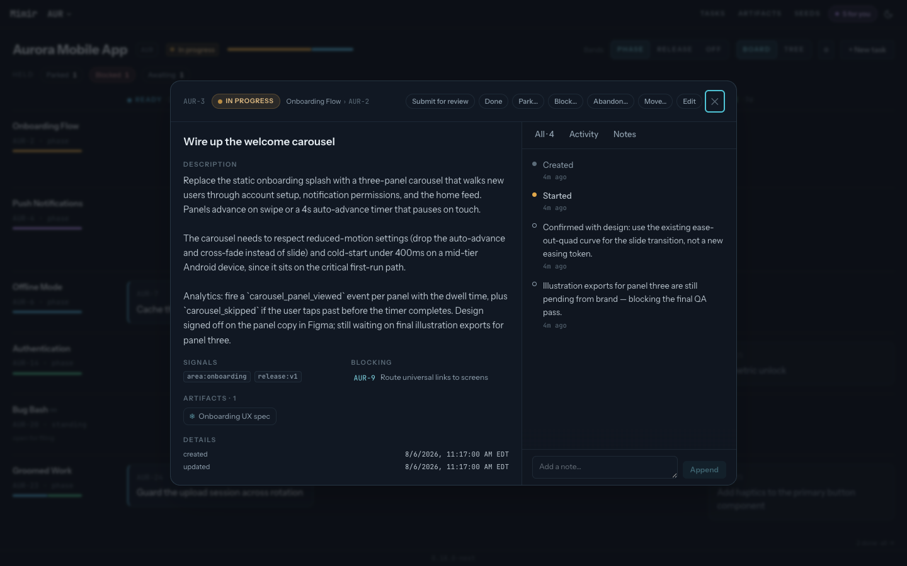

# Use the operator console

The console is the operator's view across agent-driven work. It shows current
state from the same core used by the CLI and MCP server, then provides focused
authoring and lifecycle controls.

```sh
mimir serve
```

Open the URL printed at startup. The installed production profile defaults to
`http://127.0.0.1:64647/`. The server binds to loopback; use a trusted reverse
proxy for access from another device.



## Route attention from the overview

The overview groups projects by attention state and shows the signals behind
each reading. Use it to find work awaiting review, active projects, blocked or
stale work, and projects at rest. Archived projects remain available in a
separate shelf.

From the overview you can create a project, open a project board, or jump into a
task dossier.

## Work within a project

The project page offers two views:

- **Board** groups tasks into status lanes. Rank within Ready is the queue.
- **Tree** preserves the initiative and phase hierarchy.

Open a task to inspect its description, dependencies, annotations, linked
Artifacts, history, and signals. The dossier supports field edits, tags,
annotations, lifecycle changes, dependencies, and moves. The project header
provides direction, authoring, and archive controls.

## Browse portfolio records

Portfolio-wide surfaces include:

- **Tasks** for a searchable, project-spanning task census;
- **Artifacts** for frozen work products, filters, and full content;
- **Seeds** for capture, promotion, rejection, and resolution;
- **Record health** for malformed or dropped vault records.

Routes and filters are encoded in the URL, so a specific view can be bookmarked
or shared.

## Understand offline behavior

The console is an installable PWA. It keeps the last synchronized reads and
shows an explicit offline banner when the server cannot be reached. Offline
data is for inspection only: writes are disabled and never queued for later.
