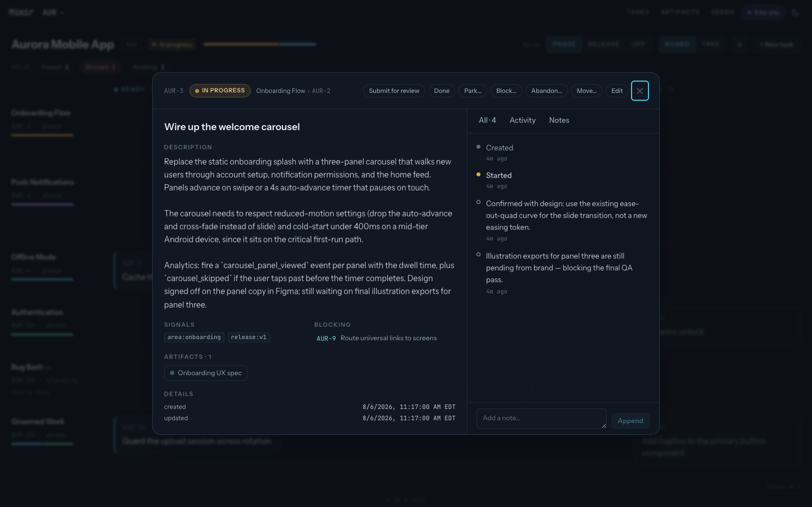

# Use the operator console

The console is the operator's view across agent-driven work. It shows current
state from the same core used by the CLI and MCP server, then provides focused
authoring and lifecycle controls.

```sh
mimir serve
```

Open the URL printed at startup. The installed production profile defaults to
`http://127.0.0.1:64647/`. The server binds to loopback unless `[serve] bind`
says otherwise. For access from another device, pick a
[network mode](../guides/port-and-proxy.md): `tailscale serve` keeps HTTPS and
the installable PWA, and a reverse proxy does too.



## Route attention from the overview

The overview groups projects by attention state and shows the signals behind
each reading. Use it to find work awaiting review, active projects, blocked or
stale work, and projects at rest. Archived projects remain available in a
separate shelf.

From the overview you can create a project, open a project's page, or jump into
a task's page.

## Work within a project

Every project, initiative, phase, and task has its own page at its own address:
`/p/MMR` for the project and `/p/MMR/417` for `MMR-417`. Typing a bare ID such as
`/MMR-417` or `/mmr` redirects to its page.

- **The project page** shows the description and the project's top-level work.
  Its rail holds the direction in full, Open board, New task, settings,
  artifacts, and details.
- **An initiative or phase page** shows the description, what the container
  holds, and its own direction in full.
- **A task page** shows the path above the task, its description, a timeline
  with a note field, and a rail with actions, agent context, dependencies,
  artifacts, and details.

On a phone, the rail folds into chips that open bottom sheets.

The board lives at `/p/MMR/board` and offers two views:

- **Board** groups tasks into status lanes. Rank within Ready is the queue.
- **Tree** preserves the initiative and phase hierarchy.

Container names in the board's bands and the tree's headers open the
container's page.

## Browse portfolio records

Portfolio-wide surfaces include:

- **Tasks** for a searchable, project-spanning task census;
- **Artifacts** for frozen work products, filters, and full content;
- **Seeds** for capture, promotion, rejection, and resolution;
- **Record health** for `mimir doctor` findings: rows the store holds in an
  inconsistent state, each with its table, key, and evidence.

Routes and filters are encoded in the URL, so a specific view can be bookmarked
or shared.

## Understand offline behavior

The console is an installable PWA. It keeps the last synchronized reads and
shows an explicit offline banner when the server cannot be reached. Offline
data is for inspection only: writes are disabled and never queued for later.
